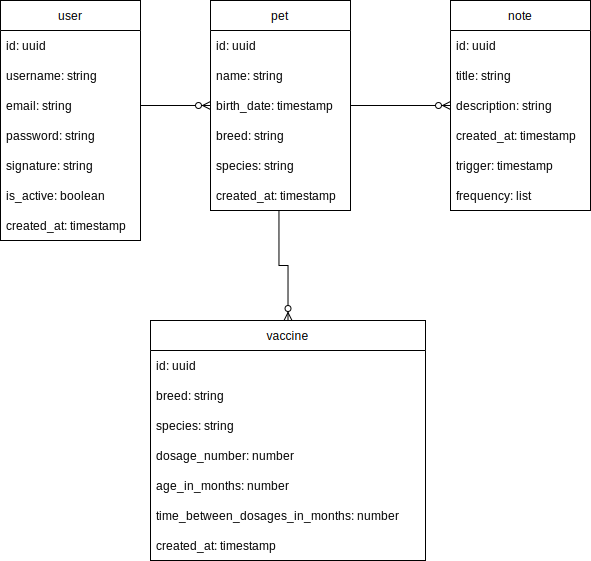

# Pet Management API

An pet management API, developed with:

- Typescript
- NodeJs
- NestJs
- PostgreSQL
- Docker

## Data Model



## Environment Configuration

This file assumes Nodejs, Nestjs and Docker are already installed.

After downloading this repository, run the following command to install all necessary dependencies.

```
npm install
```

PostgreSQL and Adminer can be executed with the following command.

```
docker-compose up
```

_Remember to end the containers processes once your done, with the following command._

```
docker-compose down
```

## Available commands

```bash
# development
$ npm run start

# watch mode
$ npm run start:dev

# production mode
$ npm run start:prod

# format project
$ npm run format

# Search for lint issues
$ npm run lint
```

## Tests

```bash
# unit tests
$ npm run test

# e2e tests
$ npm run test:e2e

# test coverage
$ npm run test:cov
```

## Author

Vitor Vidal - More about me [here](https://github.com/vitorvidaldev).

## License

This project uses [the MIT license](LICENSE).
